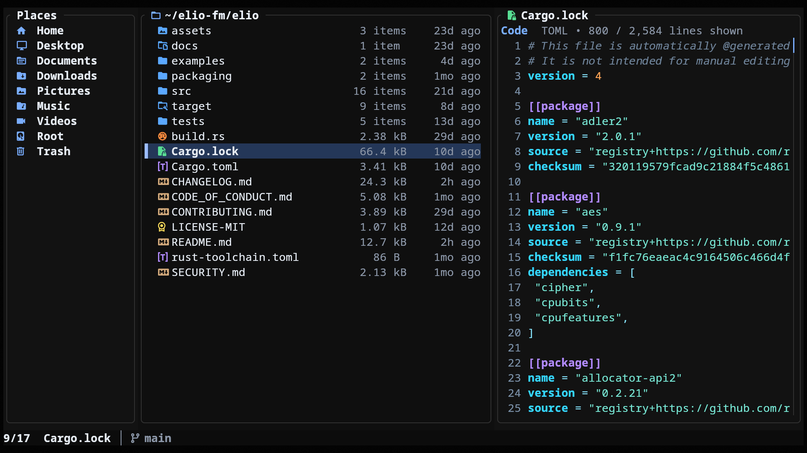

<h1 align="left">&nbsp;elio</h1>

A terminal-native file manager with a three-pane layout, rich previews, and inline images.

Built for fast workflows with bulk actions, customizable Places, trash, and quick actions like Go-to, Open With, and copy-to-clipboard.



---

## Features

- **Three-pane layout** — Places, Files, and Preview side by side
- **Rich previews** — text, code, documents, archives, media, and more; see [Preview Coverage](#preview-coverage)
- **Inline images** — rendered directly in supported terminals
- **Customizable Places and devices** — pinned folders plus auto-detected drives and mounts
- **Quick actions** — Go-to, Open With, and copy-to-clipboard
- **Trash management** — trash, restore, or permanently delete files
- **Keyboard and mouse navigation** — browse comfortably either way
- **Grid and list views** — switch with `v`, zoom the grid with `+` / `-`
- **Fuzzy search** — find folders and files quickly
- **Theming** — full palette and file-class control via `theme.toml`

---

## Installation

### Arch Linux

Install from the AUR with your preferred AUR helper:

```bash
paru -S elio
```

### Fedora

Enable the COPR repository and install with `dnf`:

```bash
sudo dnf copr enable miguelregueiro/elio
sudo dnf install elio
```

### Homebrew

Install from the Homebrew tap:

```bash
brew install elio-fm/elio/elio
```

### Cargo

Install from crates.io:

```bash
cargo install elio
```

`elio` starts in your current working directory.

> [!TIP]
> Recommended: use a Nerd Font in your terminal so icons display correctly.

<details>
<summary><strong>Running From Source</strong></summary>

```bash
cargo run --release
```

</details>

---

## Example Themes

A few bundled themes are shown below. More are available in [`examples/themes/`](examples/themes/) — copy any `theme.toml` to your platform's theme path to apply it. See [Theming](#theming) for the paths and override rules.

| Catppuccin Mocha | Tokyo Night |
|---|---|
|  |  |

| Amber Dusk | Blush Light |
|---|---|
|  |  |

---

## Image Previews

Inline visual previews, including images, covers, thumbnails, and rendered pages, work automatically on supported terminals.

| Terminal | Protocol | Status |
|---|---|---|
| [Kitty](https://sw.kovidgoyal.net/kitty/) | Kitty Graphics Protocol | ✓ Auto-detected |
| [Ghostty](https://ghostty.org/) | Kitty Graphics Protocol | ✓ Auto-detected |
| [Warp](https://www.warp.dev/) | Kitty Graphics Protocol | ✓ Auto-detected |
| [WezTerm](https://wezfurlong.org/wezterm/) | iTerm2 Inline Protocol | ✓ Auto-detected |
| [iTerm2](https://iterm2.com/) | iTerm2 Inline Protocol | ✓ Auto-detected |
| [foot](https://codeberg.org/dnkl/foot) | Sixel | ✓ Auto-detected |
| [Windows Terminal](https://github.com/microsoft/terminal) | Sixel | ✓ Auto-detected |
| Alacritty | — | Not supported |
| Other | Kitty Graphics Protocol | Set `ELIO_IMAGE_PREVIEWS=1` to enable |

> Sixel terminals can render large or first-time previews more slowly than Kitty Graphics or iTerm2 Inline backends.

Useful environment variables:

<details>
<summary><strong>Environment Variables</strong></summary>

| Variable | Effect |
|---|---|
| `ELIO_IMAGE_PREVIEWS=1` | Force-enable on unrecognized terminals that support the Kitty Graphics Protocol |
| `ELIO_DEBUG_PREVIEW` | Log image preview activity to `elio-preview.log` in the system temp directory |
| `ELIO_LOG_MOUSE` | Log raw mouse events to `elio-mouse.log` in the system temp directory |

</details>

---

## Optional Tools

`elio` works without any extra setup. These tools unlock richer previews and additional features when installed:

| Category | Tool | Command(s) | What it enables |
|---|---|---|---|
| PDF | Poppler | `pdfinfo`, `pdftocairo` | PDF metadata and rendered page previews |
| Media | ffprobe | `ffprobe` | Audio and video metadata |
| Media | ffmpeg | `ffmpeg` | Audio artwork, video thumbnails, and broader raster image format support |
| Images | resvg | `resvg` | SVG rasterization (preferred) |
| Images | ImageMagick | `magick` | SVG rasterization fallback |
| Archives | 7-Zip | `7z` | Comic archive preview and edge-case archive fallback |
| Archives | libarchive | `bsdtar` | Rare archive types and ISO fallback |
| Archives | isoinfo | `isoinfo` | Additional ISO listing fallback |

For `c`, elio copies file metadata to the clipboard using OSC52 on supported terminals, or platform clipboard tools when needed: `wl-copy` (Wayland), `xclip` / `xsel` (X11), `pbcopy` (macOS), and `clip` (Windows).

---

## Workflow

### Opening Files

`Enter` enters folders and opens files with the system default application. `o` always opens the selected file or folder externally using the system launcher: `open` on macOS, `cmd /c start` on Windows, and `xdg-open` or `gio` on Linux and BSD desktop sessions.

`O` is for files. On macOS and Linux/BSD desktop sessions, elio discovers matching applications, opens the file directly when there is one match, and shows the Open With chooser when there are multiple. Terminal apps such as `nvim` are supported too. When no match is found, or on platforms without app discovery, elio falls back to the default opener.

### Go-to Menu

`g` opens a quick jump menu with shortcuts for the top of the current folder, Downloads, Home, the platform config folder, and Trash. The config destination is `~/.config` or `$XDG_CONFIG_HOME` on Linux and BSD, `~/Library/Application Support` on macOS, and `%APPDATA%` on Windows.

### Fuzzy Search

`f` searches folders and `Ctrl+F` searches files in the current directory tree. Search follows the hidden-file setting, skips symlinks, prunes common generated folders such as `.git`, `node_modules`, and `target`, and refreshes when the directory changes. Very large trees are capped so search stays responsive.

---

## Preview Coverage

`elio` can preview a broad range of content in the Preview pane, including text, structured data, document details, archive contents, and media metadata with covers or thumbnails when available.

- **Text and code** — plain text, source code with syntax highlighting, and Markdown
- **Structured data** — JSON, JSONC, JSON5, YAML, TOML, `.env`, logs, CSV/TSV, and SQLite
- **Documents** — PDF, EPUB, DOC, DOCX, DOCM, ODT, Pages, XLSX, XLSM, ODS, PPTX, PPTM, and ODP
- **Media** — image metadata and inline previews, audio metadata and covers, and video metadata and thumbnails
- **Folders and archives** — directories, ZIP/TAR-family archives, comic archives, torrents, ISO images, and other disk-image-style containers
- **Binary files** — metadata previews for non-text files

See [Optional Tools](#optional-tools) for helpers that unlock richer metadata, thumbnails, and rendered previews.

---

## Configuration

| Platform | Config file |
|---|---|
| Linux / BSD | `~/.config/elio/config.toml` (or `$XDG_CONFIG_HOME/elio/config.toml`) |
| macOS | `~/Library/Application Support/elio/config.toml` |
| Windows | `%APPDATA%\elio\config.toml` |

See [examples/config.toml](examples/config.toml) for a complete annotated example.

Supported sections:

- `[ui]`: startup UI options like top bar, hidden files, and initial grid view
- `[places]`: pinned sidebar entries and the `Devices` section
- `[layout.panes]`: relative pane widths for Places, Files, and Preview
- `[keys]`: single-character key rebinding for browser actions

Notes:

- Omit `[places]` to keep the default sidebar.
- Omit `[layout.panes]` to use the built-in responsive layout.
- If `[layout.panes]` is set, all three pane weights must be provided.
- `places = 0` hides the Places pane, and `preview = 0` hides the Preview pane.
- `files` must be greater than `0`.
- Pane weights are relative, so `10/45/45` and `20/90/90` produce the same split.
- `places.entries` accepts built-in names, `{ builtin, icon? }`, or `{ title, path, icon? }`.
- Custom `places` paths must be absolute or start with `~/`.
- Invalid `places` entries are skipped with a warning.
- Invalid or conflicting key bindings fall back to defaults with a warning.
- Invalid TOML falls back to the built-in defaults.

---

## Theming

| Platform | Theme file |
|---|---|
| Linux / BSD | `~/.config/elio/theme.toml` (or `$XDG_CONFIG_HOME/elio/theme.toml`) |
| macOS | `~/Library/Application Support/elio/theme.toml` |
| Windows | `%APPDATA%\elio\theme.toml` |

Theme files layer on top of the built-in defaults, so you only need to set the keys you want to change.

Supported sections:

- `[palette]`: app-wide colors
- `[preview.code]`: syntax highlight colors for code previews
- `[classes.<name>]`: default icon and color for a file class
- `[extensions.<ext>]`: overrides by file extension
- `[files."<name>"]`: overrides by exact filename
- `[directories."<name>"]`: overrides by exact directory name

Rules:

- Exact filename or directory rules win over extension rules.
- Extension rules win over class defaults.
- Matching is case-insensitive.
- Invalid theme files fall back to the built-in defaults, with errors reported to stderr.

**Built-in file classes:** `directory` · `code` · `config` · `document` · `license` · `image` · `audio` · `video` · `archive` · `font` · `data` · `file`

See [`assets/themes/default/theme.toml`](assets/themes/default/theme.toml) for the full default theme.

---

<details>
<summary><strong>Controls</strong></summary>

Keys marked with `*` are configurable in `[keys]` in `config.toml`; the defaults are shown here.

### Navigation

| Key | Action |
|---|---|
| `↑` / `↓` · `j` / `k` | Move selection |
| `←` · `h` · `Backspace` | Go to parent directory |
| `→` · `l` · `Enter` | Enter folder / open file |
| `g` | Go-to menu (`g` top, `d` downloads, `h` home, `c` config folder, `t` trash) |
| `G` | Jump to last item |
| `PageUp` / `PageDown` | Page up / down |
| `Tab` / `Shift+Tab` | Cycle places |
| `Alt+←` / `Alt+→` | Back / forward in history |

### Search

| Key | Action |
|---|---|
| `f` `*` | Fuzzy-find folders in the current tree |
| `Ctrl+F` | Fuzzy-find files in the current tree |

### File Actions

| Key | Action |
|---|---|
| `o` `*` | Open with the system default application |
| `O` `*` | Open With chooser |
| `a` `*` | Create file or folder |
| `d` `*` | Trash; permanently delete if already in trash |
| `r` `*` | Rename / bulk rename / restore from trash |
| `F2` | Rename / bulk rename |

### View

| Key | Action |
|---|---|
| `v` `*` | Toggle grid / list view |
| `+` / `-` | Grid zoom in / out |
| `.` `*` | Show / hide dotfiles |
| `s` `*` | Cycle sort (Name → Modified → Size) |
| `<` / `>` `*` | Scroll preview left / right |

### Selection and Clipboard

| Key | Action |
|---|---|
| `Space` | Toggle selection |
| `Ctrl+A` | Select all |
| `y` `*` | Yank (copy) |
| `x` `*` | Cut |
| `p` `*` | Paste |
| `c` `*` | Copy path details to clipboard |

### Mouse

| Action | Description |
|---|---|
| Click | Select item |
| Double-click | Open item |
| Scroll | Scroll browser or preview |
| `Shift+Scroll` | Scroll preview sideways |

### General

| Key | Action |
|---|---|
| `?` | Open help overlay |
| `Esc` | Cancel / clear selection / close overlay |
| `q` `*` | Quit |

</details>

---

## License

[MIT](LICENSE-MIT)
