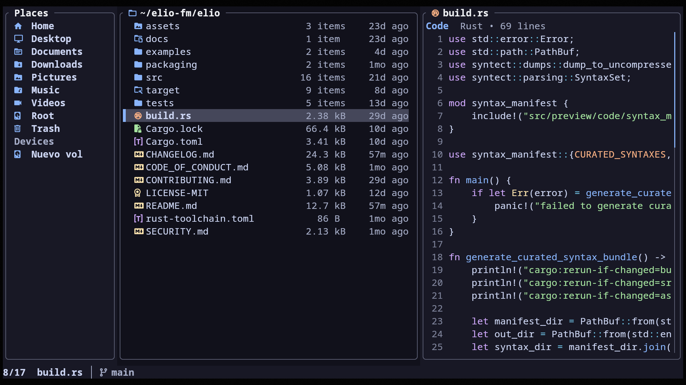
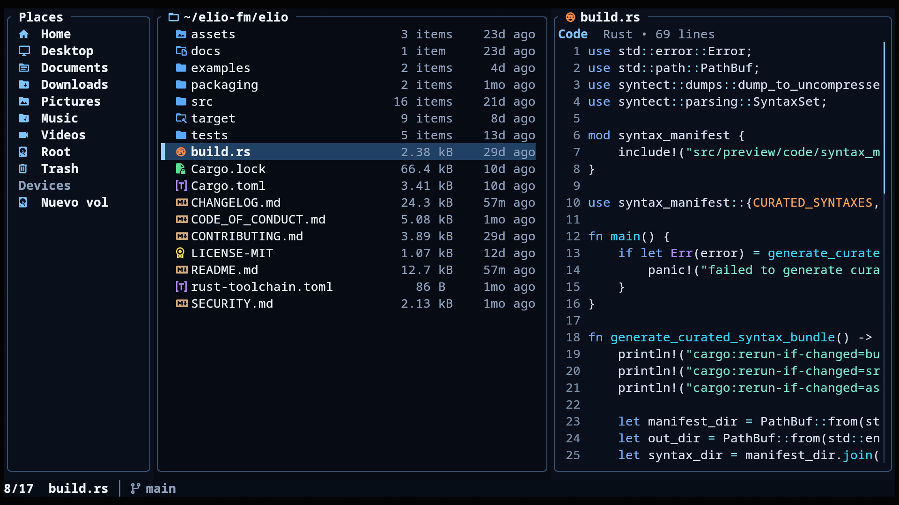
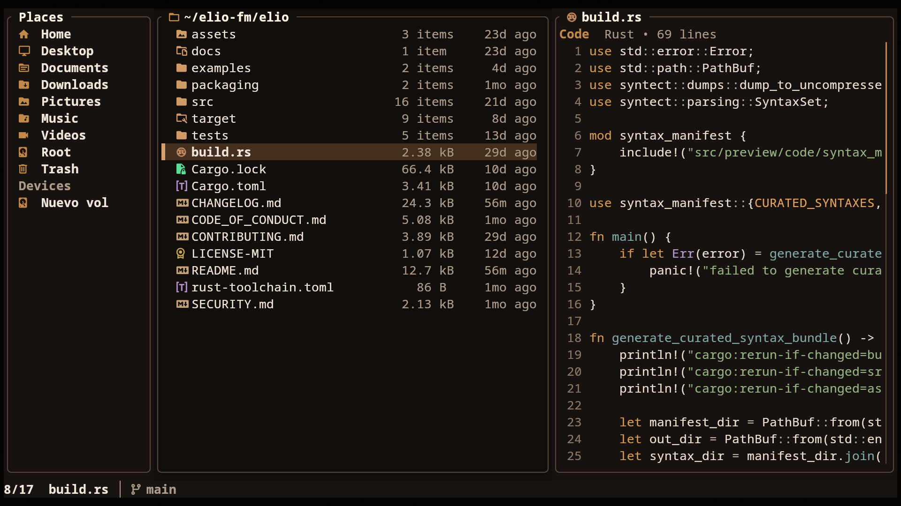
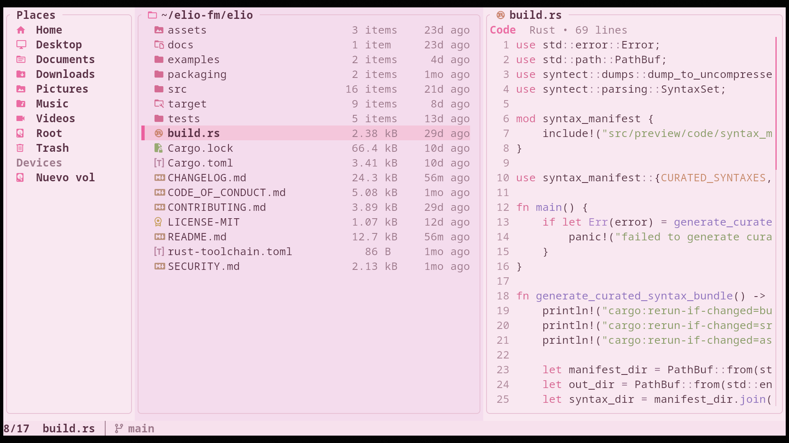

<h1 align="left">&nbsp;elio</h1>

Snappy, batteries-included terminal file manager with rich previews, inline images, bulk actions, and trash support.


## Documentation

- Installation: https://elio-fm.github.io/install/
- Docs: https://elio-fm.github.io/docs/

---

## Features

- **Three-pane layout** — Places, Files, and Preview side by side
- **Rich previews** — text, code, documents, archives, media, and more; see [Preview Coverage](#preview-coverage)
- **Archive management** — extract and create common archive formats
- **Inline images** — rendered directly in supported terminals
- **Customizable Places and devices** — pinned folders plus auto-detected drives and mounts
- **Quick actions** — Go-to, Open With, and copy-to-clipboard
- **Trash management** — trash, restore, or permanently delete files
- **Keyboard and mouse navigation** — browse comfortably either way
- **Kitty drag and drop** — drop files into elio and drag them out in Kitty 0.47+
- **Grid and list views** — switch with `v`, zoom the grid with `Ctrl++` / `Ctrl+-`
- **Fuzzy find** — find folders and files quickly
- **Zoxide jumps** — jump to frequent directories from your zoxide history
- **Shell integration** — install cd-on-exit wrappers for bash, zsh, fish, and Nushell
- **Theming** — full palette and file-class control via `theme.toml`

---

## Installation

### Arch Linux

Install from the AUR with your preferred AUR helper:

```bash
paru -S elio
```

### Fedora

Enable the COPR repository and install with `dnf`:

```bash
sudo dnf copr enable miguelregueiro/elio
sudo dnf install elio
```

### Debian and Ubuntu-based Linux

Configure the official apt repository and install with `apt`:

```bash
curl -fsSL https://elio-fm.github.io/elio-apt/install.sh | sudo sh
sudo apt install elio
```

Manual repository setup is available in [`elio-apt`](https://github.com/elio-fm/elio-apt). To install without adding a repository, download `elio_amd64.deb` from the [latest release](https://github.com/elio-fm/elio/releases/latest).

The apt repository currently publishes `amd64` packages.

### Homebrew

Install from Homebrew:

```bash
brew install elio
```

### Cargo

Install from crates.io:

```bash
cargo install elio
```

`elio` starts in your current working directory by default. Pass a file or directory path to open it instead.

> [!TIP]
> Recommended: use a Nerd Font in your terminal so icons display correctly.

---

## Example Themes

A few bundled themes are shown below. More are available in [`examples/themes/`](examples/themes/). See [Theming](#theming) for theme paths and docs.

| Catppuccin Mocha | Navi |
|---|---|
| <p align="center"></p> | <p align="center"></p> |

| Amber Dusk | Blush Light |
|---|---|
| <p align="center"></p> | <p align="center"></p> |

---

## Image Previews

Inline visual previews, including images, covers, thumbnails, and rendered pages, work automatically on supported terminals.

| Terminal | Protocol | Status |
|---|---|---|
| [Kitty](https://sw.kovidgoyal.net/kitty/) | Kitty Graphics Protocol | ✓ Auto-detected |
| [Ghostty](https://ghostty.org/) | Kitty Graphics Protocol | ✓ Auto-detected |
| [Warp](https://www.warp.dev/) | Kitty direct-placement protocol | ✓ Auto-detected |
| [WezTerm](https://wezfurlong.org/wezterm/) | iTerm2 Inline Protocol | ✓ Auto-detected |
| [iTerm2](https://iterm2.com/) | iTerm2 Inline Protocol | ✓ Auto-detected |
| [Konsole](https://konsole.kde.org/) | Kitty direct-placement protocol | ✓ Auto-detected |
| [foot](https://codeberg.org/dnkl/foot) | Sixel | ✓ Auto-detected |
| [Windows Terminal](https://github.com/microsoft/terminal) | Sixel | ✓ Auto-detected |
| Alacritty | — | Not supported |
| Other | Kitty Graphics Protocol | Set `ELIO_IMAGE_PREVIEWS=1` to enable |

> Sixel terminals can render large or first-time previews more slowly than Kitty Graphics or iTerm2 Inline backends.
>
> In Konsole, inline previews are temporarily cleared while modal popups are open to avoid rendering artifacts.

Useful environment variables:

<details>
<summary><strong>Environment Variables</strong></summary>

| Variable | Effect |
|---|---|
| `ELIO_IMAGE_PREVIEWS=1` | Force-enable on unrecognized terminals that support the Kitty Graphics Protocol |
| `ELIO_ZOXIDE_OPTS` | Extra options appended to the zoxide interactive picker options |
| `ELIO_DEBUG_PREVIEW` | Log image preview activity to `elio-preview.log` in the system temp directory |
| `ELIO_LOG_MOUSE` | Log raw mouse events to `elio-mouse.log` in the system temp directory |

</details>

---

## Preview Coverage

elio previews many file types:

- Text, source code, Markdown, logs, and structured data such as JSON, YAML, TOML, CSV/TSV, and SQLite
- Documents such as PDFs, ebooks, Office files, OpenDocument files, and Apple Pages
- Images, audio, and video metadata, with inline images, covers, and thumbnails when supported
- Folders, archives, comic archives, torrents, ISO images, and other container-style files
- Fonts, binary files, and other metadata-focused previews

See the preview docs:
https://elio-fm.github.io/docs/previews/

---

## Optional Preview Tools

elio works out of the box. Optional tools unlock richer previews:

- `poppler` for PDFs
- `ffmpeg` / `ffprobe` for media metadata and thumbnails
- `resvg` for SVG previews
- 7-Zip for more archive types, comic archives, and RAR support

See the optional tools docs:
https://elio-fm.github.io/docs/optional-tools/

---

## Using elio over SSH

elio works over SSH. For the best experience, use a supported terminal and install optional tools on the remote host.

Opening files with terminal apps works normally inside SSH sessions. Desktop apps may open files on the remote host or do nothing useful.

---

## Change Directory on Quit

elio can leave your shell in the directory you were browsing when you quit:

```bash
elio shell install
```

Restart your shell, then run `elio` normally. Press `q` to quit and move your shell to elio's final directory, or `Q` to quit without changing directories.

See the shell integration docs for uninstall steps, supported shells, and manual setup:
https://elio-fm.github.io/docs/shell-integration/

---

## Configuration

elio reads configuration from:

| Platform | Config file |
|---|---|
| Linux / BSD | `~/.config/elio/config.toml` or `$XDG_CONFIG_HOME/elio/config.toml` |
| macOS | `~/.config/elio/config.toml` or `~/Library/Application Support/elio/config.toml` |
| Windows | `%APPDATA%\elio\config.toml` |

See [`examples/config.toml`](examples/config.toml) for an annotated example, or the configuration docs:
https://elio-fm.github.io/docs/configuration/

---

## Theming

elio themes are TOML files layered on top of the built-in defaults, so you only need to set the keys you want to change.

| Platform | Theme file |
|---|---|
| Linux / BSD | `~/.config/elio/theme.toml` or `$XDG_CONFIG_HOME/elio/theme.toml` |
| macOS | `~/.config/elio/theme.toml` or `~/Library/Application Support/elio/theme.toml` |
| Windows | `%APPDATA%\elio\theme.toml` |

See [`assets/themes/default/theme.toml`](assets/themes/default/theme.toml) for the full default theme and [`examples/themes/`](examples/themes/) for ready-made themes.

For transparent or terminal-palette setups, see [`examples/themes/transparent/theme.toml`](examples/themes/transparent/theme.toml) and [`examples/themes/terminal-ansi/theme.toml`](examples/themes/terminal-ansi/theme.toml).

Theme docs:
https://elio-fm.github.io/docs/themes/

---

<details>
<summary><strong>Controls</strong> — press <code>?</code> in elio to see current bindings, including overrides</summary>

Keys marked with `*` are configurable in `[keys]` in `config.toml`. Configurable actions accept one key, a list, or an empty list to unbind the action. See the configuration docs for full key syntax:
https://elio-fm.github.io/docs/configuration/

### Navigation

| Key | Action |
|---|---|
| `k` / `↑` `*` | Move up |
| `j` / `↓` `*` | Move down |
| `h` / `←` / `Backspace` `*` | Go to parent directory |
| `l` / `→` `*` | Enter folder |
| `Enter` `*` | Enter folder / open file or selection |
| `g` `*` | Go To menu (`g` top, `d` downloads, `h` home, `c` config folder, `t` trash; configurable in `[goto]`) |
| `Home` `*` | Jump to first item |
| `G` / `End` `*` | Jump to last item |
| `PageUp` / `PageDown` `*` | Page up / down |
| `Tab` / `Shift+Tab` `*` | Cycle places |
| `Alt+←` / `Alt+→` `*` | Back / forward in history |

### Search

| Key | Action |
|---|---|
| `f` `*` | Fuzzy-find folders in the current tree |
| `Ctrl+F` `*` | Fuzzy-find files in the current tree |
| `z` `*` | Jump with zoxide directory history |

### File Actions

| Key | Action |
|---|---|
| `o` `*` | Open focused item or selection with the system default application |
| `O` `*` | Open With chooser |
| `!` `*` | Open shell in current folder |
| `a` `*` | Create file or folder |
| `d` / `Del` `*` | Trash; permanently delete if already in trash |
| `D` / `Shift+Del` `*` | Delete permanently |
| `r` / `F2` `*` | Rename / bulk rename |
| `R` / `Shift+F2` `*` | Rename in editor |
| `r` `*` (in Trash) | Restore from trash |

### View

| Key | Action |
|---|---|
| `v` `*` | Toggle grid / list view |
| `Ctrl++` / `Ctrl+-` | Grid zoom in / out |
| `.` `*` | Show / hide dotfiles |
| `s` `*` | Cycle sort (Name → Modified → Size) |

### Preview

| Key | Action |
|---|---|
| `Shift+K` / `[` `*` | Step page (PDF, comic, EPUB) or scroll preview up |
| `Shift+J` / `]` `*` | Step page (PDF, comic, EPUB) or scroll preview down |
| `Shift+H` / `Shift+L` `*` | Scroll preview left / right |

### Selection and Clipboard

| Key | Action |
|---|---|
| `Space` `*` | Toggle selection |
| `Ctrl+A` `*` | Select all |
| `y` `*` | Yank (copy) |
| `x` `*` | Cut |
| `p` `*` | Paste |
| `-` `*` | Create absolute symlink from yanked items |
| `_` `*` | Create relative symlink from yanked items |
| `c` `*` | Copy path details to clipboard |

### Mouse

| Action | Description |
|---|---|
| Click | Select item |
| Double-click | Open item |
| Scroll | Scroll browser or preview |
| `Shift+Scroll` | Scroll preview sideways |

### General

| Key | Action |
|---|---|
| `?` | Open help overlay |
| `Esc` | Cancel / clear selection / close overlay |
| `q` `*` | Quit |
| `Q` `*` | Quit without changing the shell directory |

</details>

---

## License

[MIT](LICENSE-MIT)
